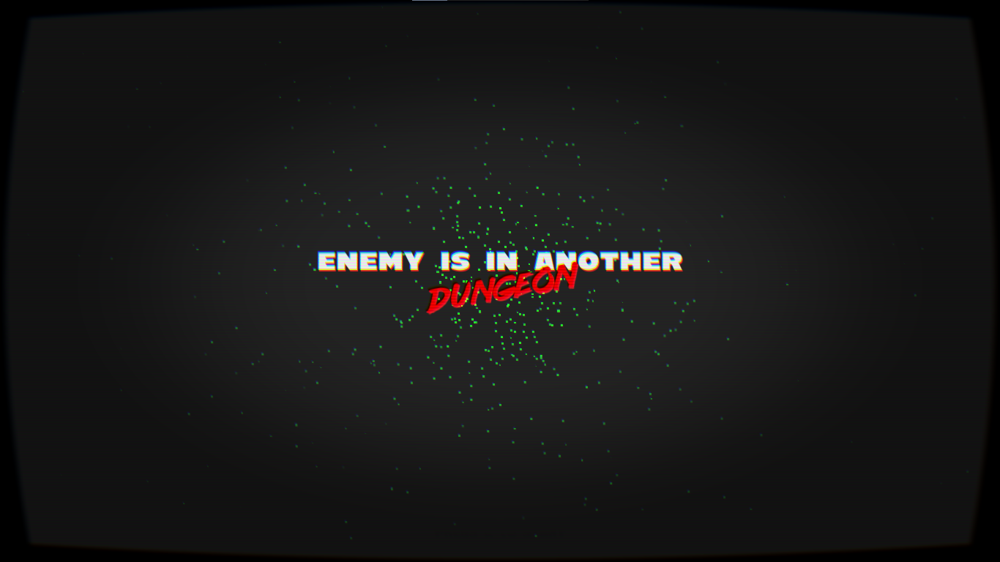

## Your Enemy is in Another Dungeon



This game is written in lua and LÖVE 2D framework. You may need LÖVE 2D installed to run.

### Controls
```
WASD - Move
F4 - Toggle Fullscreen
ESCAPE - Exit
```

### Libraries Used
- [anim8](https://github.com/kikito/anim8)
- [hump](https://github.com/vrld/hump)
- [moonshine](https://github.com/vrld/moonshine)
- [o-ten-one](https://github.com/love2d-community/splashes)
- [sti](https://github.com/karai17/Simple-Tiled-Implementation)
- [windfield](https://github.com/a327ex/windfield)


Also few assets are deliberately not included due to license.

Distributed under GPL 3.0.

```Indrajith K L, 2022```